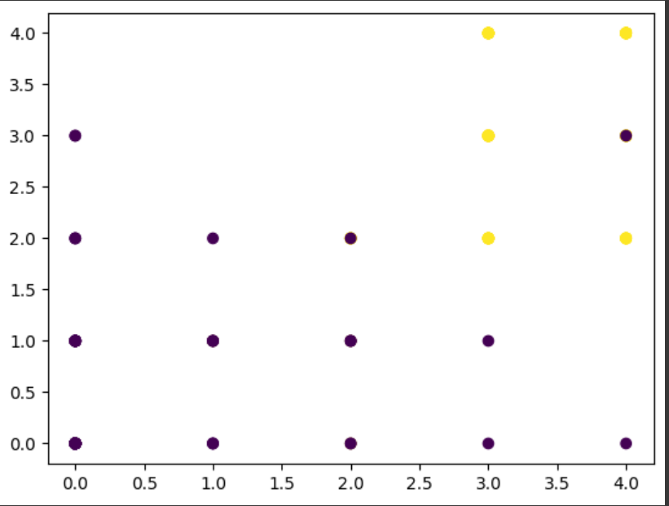
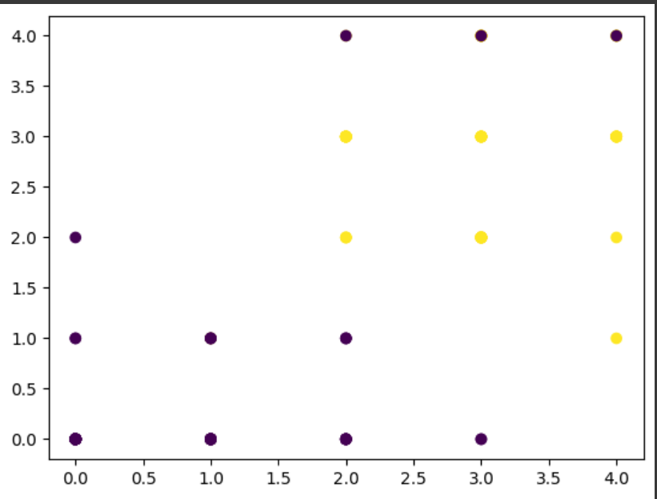
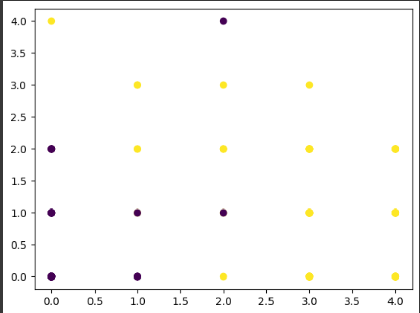

In order to better understand the workings of the k-nearest neighbor algorithm I started this personal project.

The k-nearest neighbor algorithm is a lazy classification algorithm meaning that it does not rely on training a model in order to make decisions. Instead, it just compares new data to old data it already has and classifies. In the case of k-nearest neighbor, we calculate the k closest points to some point x and classify x based on what each of these k points are. For this project, I will utilize both the Euclidean distance and Manhattan distance formulas.

The focal point of this project will be determining whether a couple will divorce or stay together based on the individual's responses to a 54 question survey. For each question they will give an answer from 0-4. The dataset includes approximately the same proportion of responses from male and female individuals as well as approximately the same proportion of divorced and married individuals. This dataset was found on kaggle and will be made available via a link below or as a .csv included with this file.

I started this project as an introduction to using python for basic AI purposes. In that vein, this project was a major success. I got experience managing dataframes with pandas, planning a project from start to finish, doing mathematics for higher dimensions that I am used to, and most importantly learned the fundamentals of the KNN algorithm. In the end I had functioning code to calculate this dataset and with minor changes I could abstract this code to work for any other. Overall it was an enjoyable experience.

